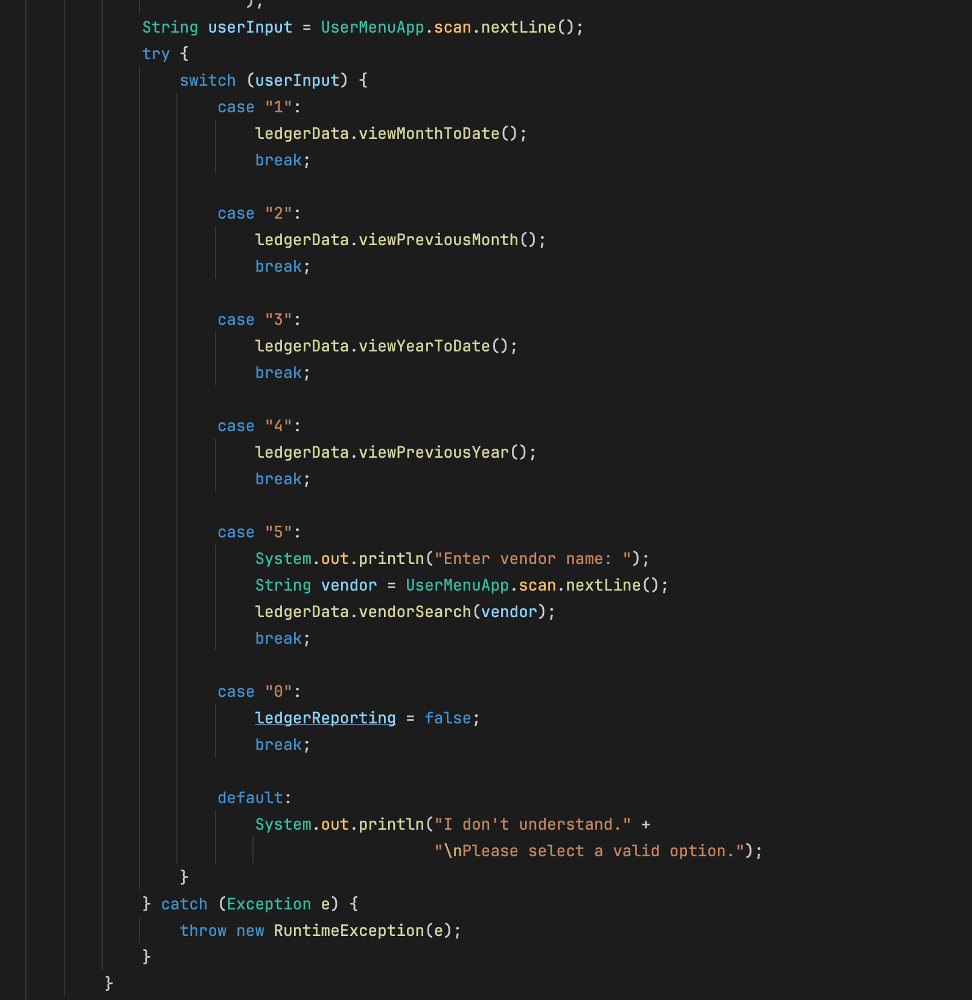
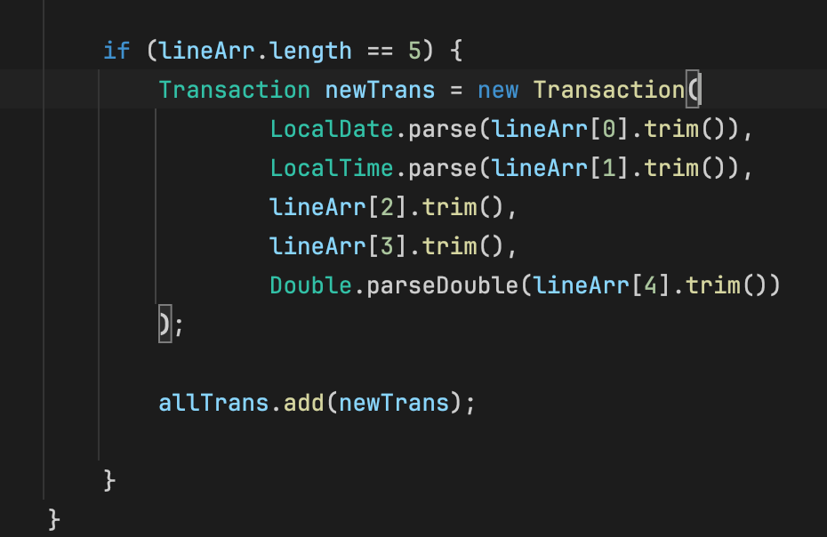
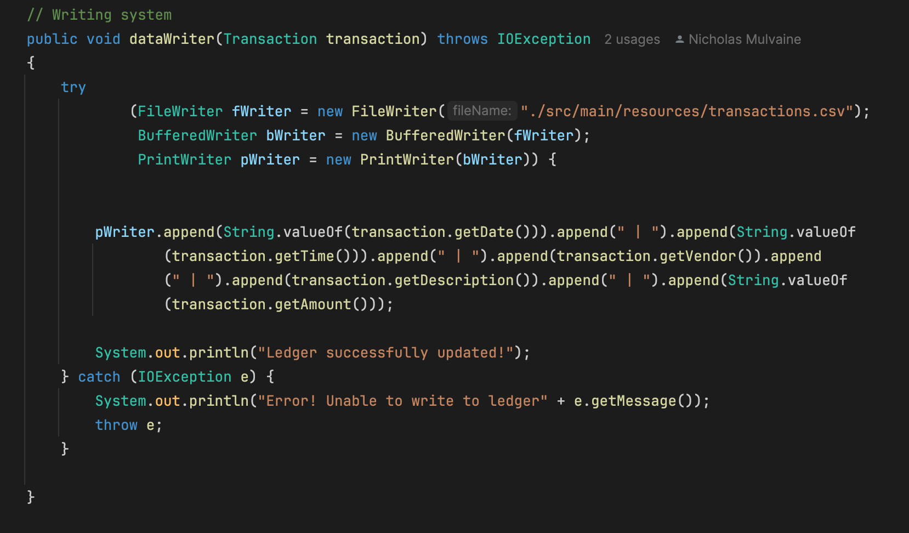
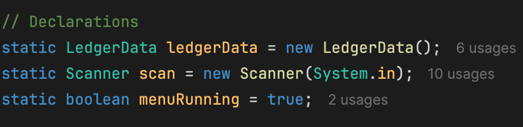
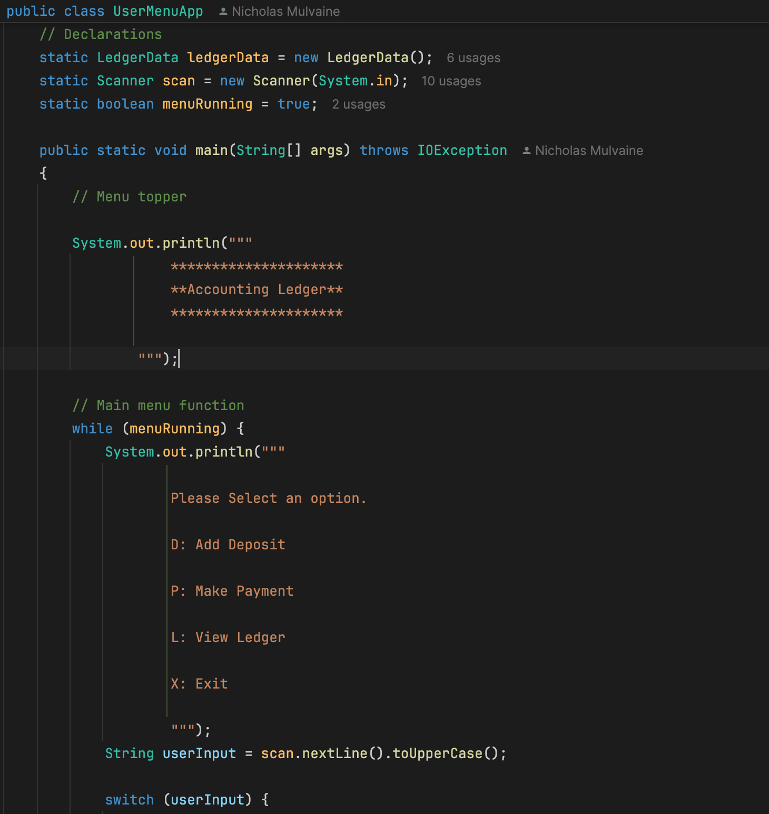

Ledger-Application

Nicholas Mulvaine

10/15/2024

Capstone-1

———————————————————————————

## Overview ##

This project is a Java based ledger system. Allowing for transactions and deposits to be logged the user has the ability to sort using various methods such as year to date, previous month, and by vendor.

This application is built mainly upon three classes, LedgerData, Transaction, and UserMenuApp. These three classes are in one way or another interacting with a transactions.txt file.

—————————————————————————————————————————————————————————————————————————————————

—————————————————————————————————————————————————————————————————————————————————

—————————————————————————————————————————————————————————————————————————————————

—————————————————————————————————————————————————————————————————————————————————

—————————————————————————————————————————————————————————————————————————————————

